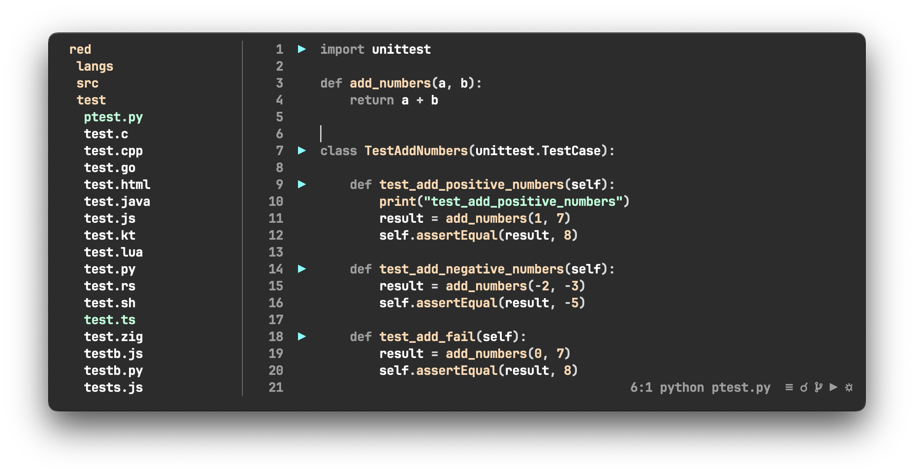

# RED

## Introduction

`red` is a console-based text editor designed to be simple and efficient. It provides a straightforward interface for users who prefer command-line editing. 




## Features

### Intuitive

`red` provides a clean and straightforward interface, making it easy to navigate and edit text efficiently. `red` also features intuitive key bindings, allowing users to perform common tasks quickly and effortlessly.

### Performance

`red` leverages Rust's efficiency for lightning-fast text editing, ensuring that it consumes fewer resources as possble. With optimized cursor movement, content redraw, and Tree Sitter integration for highlighting, it ensures a responsive and efficient editing experience.

### Mouse Support

`red` provides robust mouse and touchpad support, enabling smooth navigation, scrolling, selection. Furthermore, `red` is designed with keyboard-only users in mind, ensuring a seamless experience for all input preferences.

### Code execution
With `red`, executing code to a Tmux session is as simple as a button click. Enjoy the convenience of seamlessly integrating code execution with your Tmux sessions, streamlining your workflow with ease.

### Lsp
`red` supports the Language Server Protocol (LSP), enhancing your coding experience with intelligent code completion, real-time diagnostics, go to definition, references and more. 

### Search
`red` offers both local and global search capabilities, allowing users to effortlessly find text within their documents. With simple match movement, navigating through search results is intuitive and efficient, ensuring a seamless editing experience.

### Themes
`red` comes with a variety of themes to personalize your editing experience. Choose from a selection of carefully crafted themes or create your own to suit your preferences. Compare to others terminal editors, red distinguishes itself by prioritizing background color customization, allowing the window to be fully transparent in accordance with glassmorphism design trends.

### Discussion 

https://t.me/red_rs_editor

### Prerequisites

- Rust: Ensure you have Rust installed on your system.
- Cargo: `red` is built using Cargo, Rust's package manager.

## Installation

1. Clone the repository:
   ```bash
   git clone https://github.com/red-rs/red.git
   ```

2. Navigate to the project directory:
   ```bash
   cd red
   ```

3. Install Rust:
   ```bash 
   curl --proto '=https' --tlsv1.2 -sSf https://sh.rustup.rs | sh
   source $HOME/.cargo/env
   ```

4. Build the project:
   ```bash
   cargo build --release
   ```

5. Set the RED_HOME env, add it to the PATH and apply (~/.bashrc or ~/.zshrc):
   ```bash
   # bash
   echo "export RED_HOME=$(pwd)" >> ~/.bashrc
   echo 'export PATH="$RED_HOME/target/release:$PATH"' >> ~/.bashrc
   source ~/.bashrc
   
   # zsh
   echo "export RED_HOME=$(pwd)" >> ~/.zshrc
   echo 'export PATH="$RED_HOME/target/release:$PATH"' >> ~/.zshrc
   source ~/.zshrc
   ```
6. Run red:
   ```bash
   red file.txt
   ```

## Key bindings and features:
- `Control + q` - quit
- `Control + s` - save
- `Control + c` - copy 
- `Control + v` - paste
- `Control + x` - cut 
- `Control + d` - duplicate
- `Control + z` - undo
- `Control + f` - find
- `Control + f, type prefix, Control + g` - global find
- `Control + o` - cursor back
- `Control + p` - cursor forward

- `Shift + arrow` - select text
- `Option + right/left` - smart horizontal movement
- `Option + down/up` - smart selection
- `Option + delete` - delete line
- `Option + /` - comment line
- `Control + Shift + down/up` - lines swap

- `mouse selection`  - select text 
- `mouse double click`  - select word 
- `mouse triple click`  - select line


- `Control + space` - lsp completion
- `Control + h` - lsp hover
- `Control + g / Control + mouse click` - lsp definition
- `Control + r / Option + mouse click` - lsp references
- `Control + e` - lsp diagnostic (errors)

## LSP

`red` assumes that you will install the LSP server by yourself and lsp is available from the terminal.

```shell  

# rust 
# curl --proto '=https' --tlsv1.2 -sSf https://sh.rustup.rs | sh
rustup component add rust-analyzer

# python
pip install -U 'python-lsp-server[all]'

# js/ts
npm i -g typescript typescript-language-server

# html
npm i -g vscode-langservers-extracted

# c/c++
# go to https://clangd.llvm.org/installation.html
clangd

# go
go install golang.org/x/tools/gopls@latest

# java 
# jdtls

# kotlin
# https://github.com/fwcd/kotlin-language-server
# mac
brew install kotlin-language-server

# swift
# https://github.com/apple/sourcekit-lsp
xcrun

# bash
npm i -g bash-language-server


# zig
# mac
brew install zls

```

You can change the LSP settings in the `config.toml` file.

## Performance Comparison

In the following test cases, the performance of `red` is compared to other popular editors, including Neovim (`nvim`), Helix, IntelliJ IDEA (`idea`), and different terminal emulators.

| Test Case              | `red` | `nvim` | `nvim (astro)` | `helix` | `red+alacritty`|`red+alacritty +rust-analyzer` | `idea` | `red+mac terminal` | `red+iterm` |
| ---------------------- |-------|--------|----------------|---------| ---------------| -------- |  ----- | ------------------ | ----------- |
| Cursor movement, cpu % | 0.5   | 5      | 6              | 4       |     0.4 + 12   | | 60     |       25           |     30      |
| Arrow scrolling, cpu % | 3     | 7      | 20             | 6       |     3+20       | | 65     |       40           |     50      |
| Mouse scrolling, cpu % | 15    | 30     | 45             | 30      |     20+30      | | 55     |       60           |     130     |
| Text editing,    cpu % | 5     | 10     | 30             | 8       |     4+20       | 4+20+70  | 600  |   40        |     45      |

